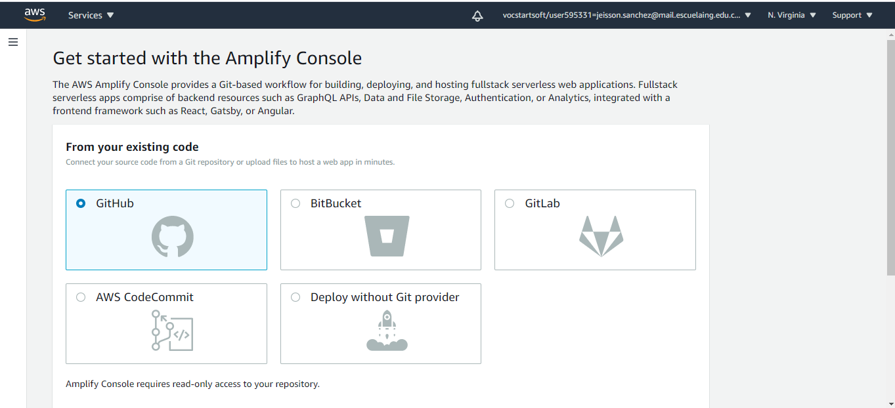
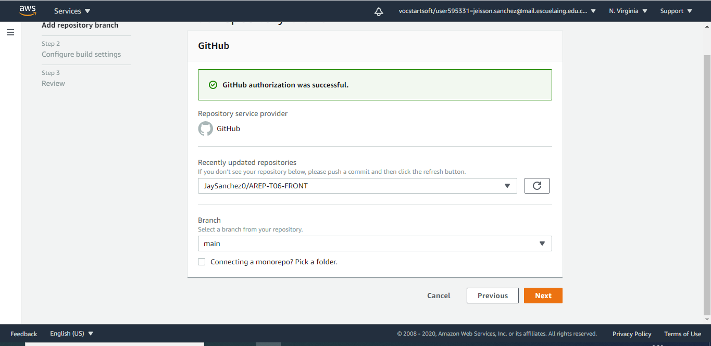
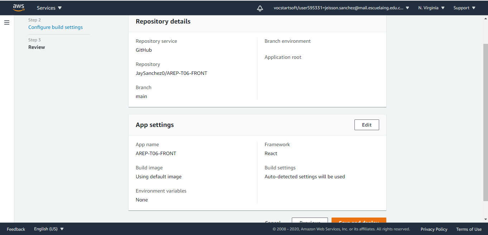
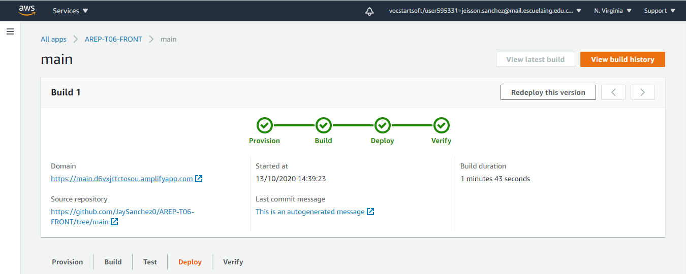
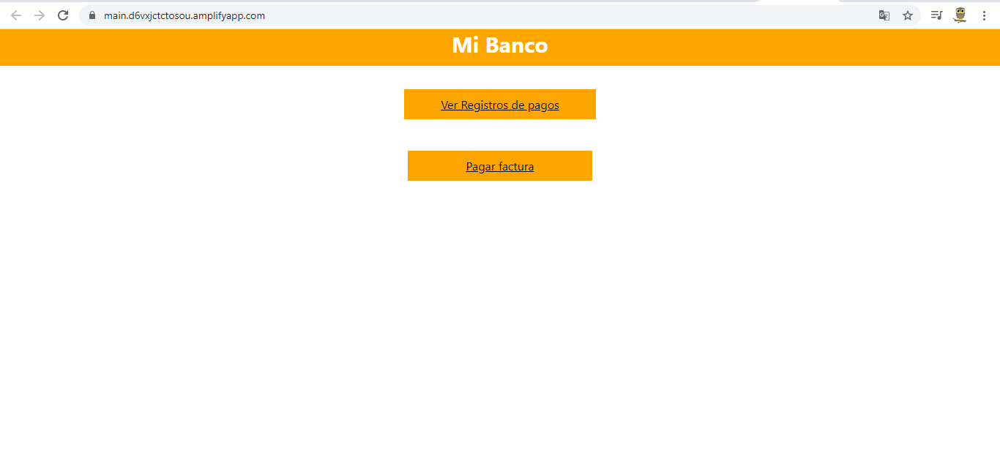

# AREP-T06-FRONT

### Presentado por:

Jeisson G. Sanchez R.

### Despliegue en produccion:

Vamos a desplegar la aplicacion en aws desde github para ello se utilizara amplify

aqui vamos a seleccionar github

seleccionamos nuestro repo de github y la rama a desplegar

