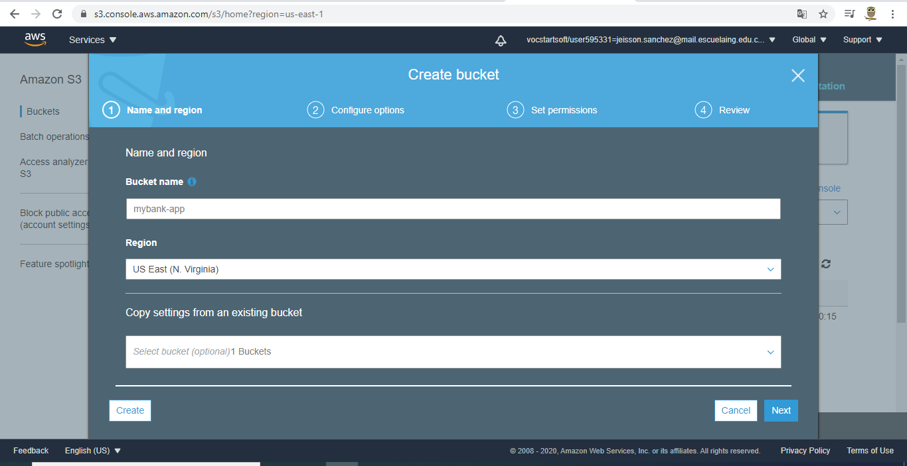
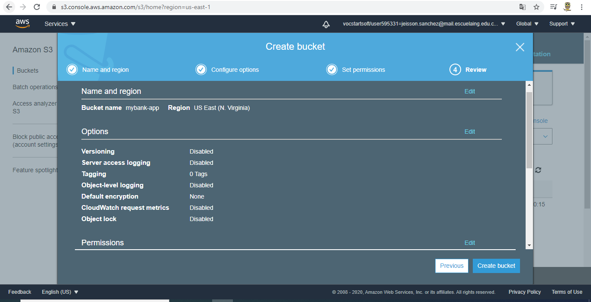

# AREP-T06-FRONT

### Presentado por:

Jeisson G. Sanchez R.

### Despliegue con s3

Creamos una instancia de s3

Damos permisos para que el contenido de s3 en este caso la aplicacion web sea publico

Una vez creada nuestra instancia de S3, construimos nuestra aplicacion react

Despues procedemos a cargar el contenido de la carpeta build en nuestra instancia de s3

Aqui podemos consultar el contenido

Ya despues de esto podemos consultar nuestra aplicacion

### Despliegue en produccion con amplify:

Vamos a desplegar la aplicacion en aws desde github para ello se utilizara amplify

aqui vamos a seleccionar github

seleccionamos nuestro repo de github y la rama a desplegar

